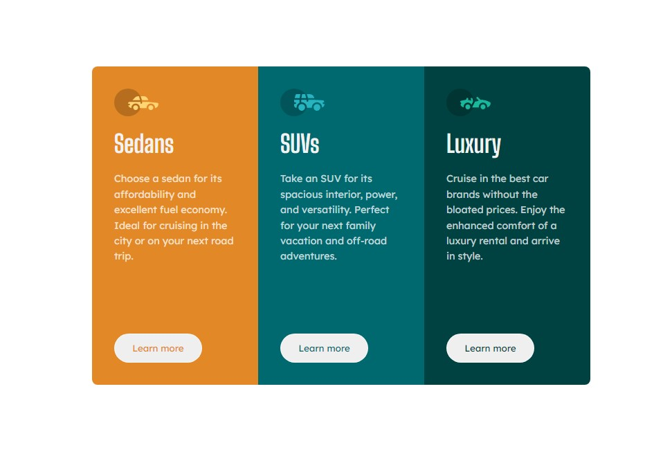

# Frontend Mentor - 3-column preview card component


## Table of contents

- [Overview](#overview)
  - [The challenge](#the-challenge)
  - [Screenshot](#screenshot)
  - [Links](#links)
- [My process](#my-process)
  - [Built with](#built-with)
  - [What I learned](#what-i-learned)
- [Author](#author)


## Overview

### The challenge

Users should be able to:

- View the optimal layout depending on their device's screen size
- See hover states for interactive elements

### Screenshot




### Links

- Live Site URL: [Live Demo](https://3-column-preview-o.netlify.app/)

## My process

### Built with

- Semantic HTML5 markup
- CSS custom properties
- CSS Grid


### What I learned

- CSS Grid

```css

.cards__container {
    max-width: 720px;
    display: grid;
    grid-template-columns: repeat(3, 1fr);
    justify-content: center;
    align-items: center;
    border-radius: 8px;
    overflow: hidden;
}

.card {
    display: grid;
    grid-template-rows: 1fr 1fr 1fr 2fr;
    height: 460px;
    padding: 2rem;
}
```


## Author
- Frontend Mentor - [@Master-Osaro](https://www.frontendmentor.io/profile/yourusername)
- Twitter - [@iyoha_osaro](https://www.twitter.com/yourusername)
